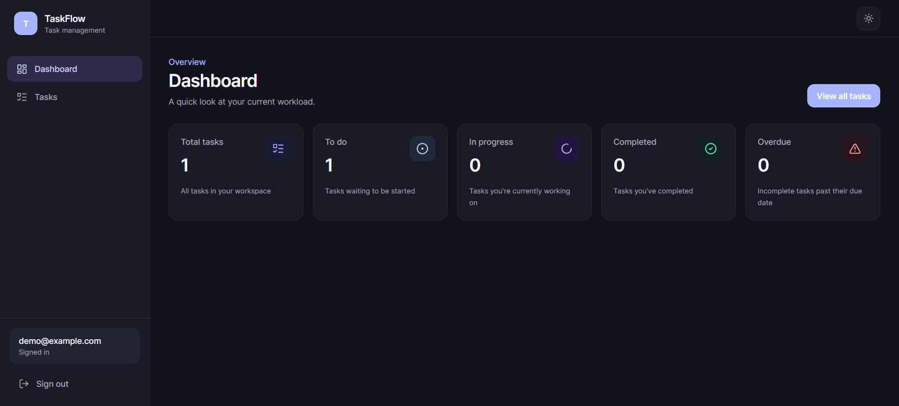
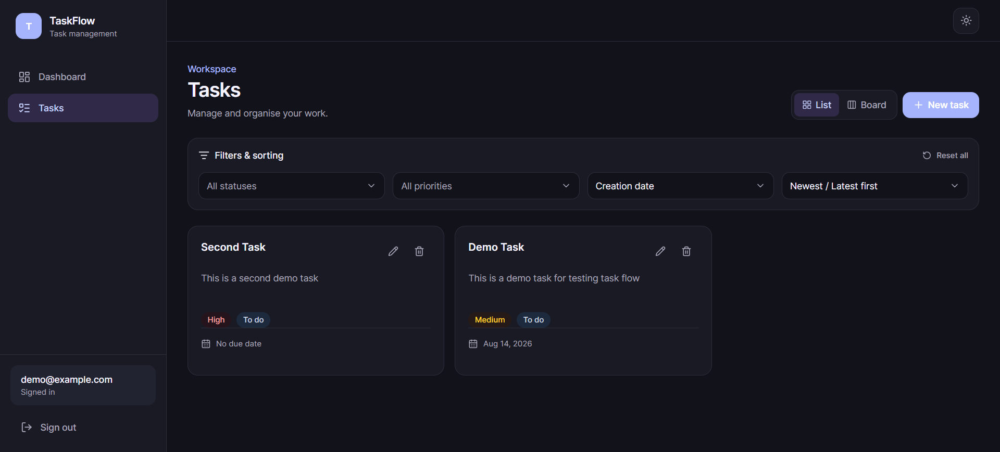
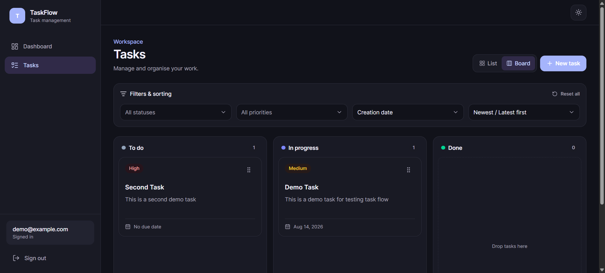
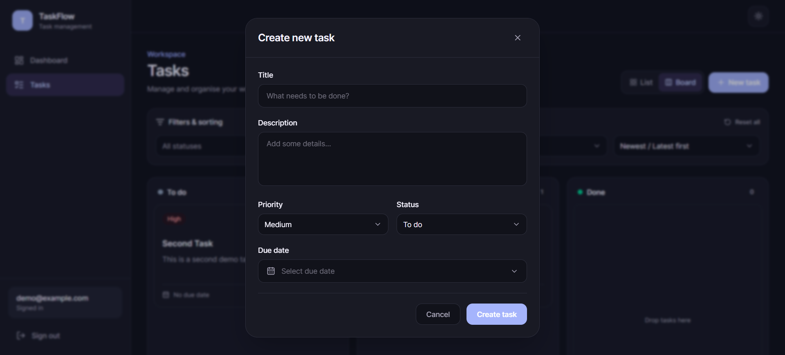
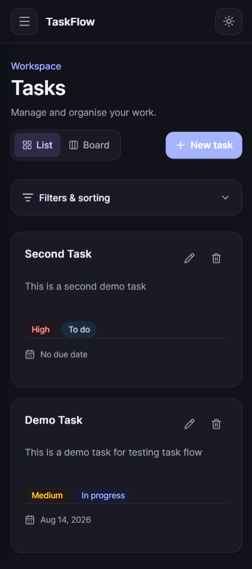
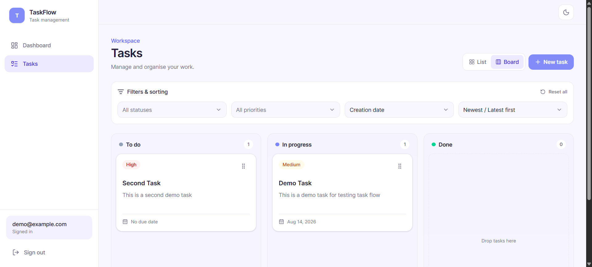

# TaskFlow — Task Management Application

TaskFlow is a full-stack task management application built as a take-home assignment. It provides secure authentication, task CRUD operations, filtering and sorting, dashboard statistics, responsive layouts, dark mode, and a drag-and-drop Kanban board.

The project is organized as a monorepo with separate frontend and backend applications.

## Live Application

- **Frontend:** `https://task-flow-53440.web.app`
- **Backend API:** `https://task-management-4wyu.onrender.com`
- **API Documentation (Swagger):** `https://task-management-4wyu.onrender.com/api/docs`


## Tech Stack

### Frontend

- React 19
- TypeScript
- Vite
- React Router
- TanStack Query
- Zustand
- React Hook Form
- Zod
- Tailwind CSS
- `@dnd-kit/react`
- `@daypicker/react`
- Lucide React
- Vitest
- React Testing Library

### Backend

- Node.js
- Express
- TypeScript
- MongoDB
- Mongoose
- JWT authentication
- bcrypt
- Zod
- Helmet
- CORS
- express-rate-limit
- Pino / pino-http
- Swagger / OpenAPI
- Vitest
- Supertest
- mongodb-memory-server

### Deployment

- **Frontend:** Firebase Hosting
- **Backend:** Render
- **Database:** MongoDB Atlas

## Features

### Authentication

- User registration
- User login
- JWT-based authentication
- Protected frontend routes
- Protected backend endpoints
- Automatic logout on unauthorized API responses
- Persistent frontend authentication state

### Task Management

- Create, view, edit, and delete tasks
- Priority: Low, Medium, High
- Status: To Do, In Progress, Done
- Optional due date
- Filter by status and priority
- Combine filters
- Sort by creation date or due date
- Ascending / descending sorting
- Overdue-task support
- List and Kanban views

### Dashboard

- Total tasks
- To Do
- In Progress
- Completed
- Overdue

### Kanban Board

- Drag tasks between status columns
- Dedicated drag handle
- Optimistic UI updates
- Rollback on failed status update
- Persistent List / Board preference

### UI / UX

- Responsive desktop, tablet, and mobile layouts
- Light and dark themes
- Custom Select component
- Custom date picker
- Mobile collapsible filters
- Animated mobile navigation
- Modal, dropdown, toast, and filter transitions
- Loading, empty, and error states
- Reduced-motion support

### API / Security

- JWT middleware
- Owner-scoped task authorization
- bcrypt password hashing
- Zod validation
- Centralized error handling
- Standardized API response envelope
- Helmet
- CORS
- Rate limiting
- Request logging
- Proxy-aware production configuration
- Swagger/OpenAPI documentation

## Project Structure

```text
task-management/
├── backend/
│   ├── src/
│   ├── ARCHITECTURE.md
│   ├── .env.example
│   └── package.json
│
├── frontend/
│   ├── public/
│   ├── src/
│   ├── ARCHITECTURE.md
│   ├── .env.example
│   └── package.json
│
├── docs/
│   └── screenshots/
│
└── README.md
```

## Screenshots

Screenshots in:

```text
docs/screenshots/
```

### Dashboard



### Task List



### Kanban Board



### Create / Edit Task



### Mobile View



### Light Mode



## Getting Started

### Prerequisites

- Node.js
- npm
- MongoDB locally, or MongoDB Atlas

Clone the repository:

```bash
git clone https://github.com/Manmeet567/task-management
cd task-management
```

## Backend Setup

```bash
cd backend
npm install
```

Create `.env` from `.env.example`.

macOS/Linux:

```bash
cp .env.example .env
```

Windows PowerShell:

```powershell
Copy-Item .env.example .env
```

Example:

```env
NODE_ENV=development
PORT=5000
MONGODB_URI=mongodb://127.0.0.1:27017/task_management
CLIENT_ORIGIN=http://localhost:5173
JWT_SECRET=replace_with_a_secure_secret_at_least_32_characters_long
JWT_EXPIRES_IN=1h
TRUST_PROXY_HOPS=0
```

Start:

```bash
npm run dev
```

API:

```text
http://localhost:5000/api
```

Swagger:

```text
http://localhost:5000/api/docs
```

Verify:

```bash
npm run verify
```

If keeping the seed script in the final repository:

```bash
npm run seed
```

Demo credentials:

```text
Email: demo@example.com
Password: DemoPassword123!
```

## Frontend Setup

```bash
cd frontend
npm install
```

Create `.env` from `.env.example` and set:

```env
VITE_API_URL=http://localhost:5000/api
```

Start:

```bash
npm run dev
```

Quality checks:

```bash
npm test
npm run lint
npm run build
```

If a frontend `verify` script is included:

```bash
npm run verify
```

## API Overview

```text
POST   /api/auth/register
POST   /api/auth/login

GET    /api/tasks
POST   /api/tasks
GET    /api/tasks/dashboard
GET    /api/tasks/:id
PATCH  /api/tasks/:id
DELETE /api/tasks/:id
```

For the complete API contract, use Swagger:

```text
https://task-management-4wyu.onrender.com/api/docs
```

## Architecture

- [`backend/ARCHITECTURE.md`](./backend/ARCHITECTURE.md) — backend architecture
- [`frontend/ARCHITECTURE.md`](./frontend/ARCHITECTURE.md) — frontend architecture

High-level deployment flow:

```text
Browser
   │
   ▼
React / Vite Frontend
   │
   │ HTTPS REST
   ▼
Node / Express API
   │
   │ Mongoose
   ▼
MongoDB Atlas
```

## Testing

### Backend

- Vitest
- Supertest
- mongodb-memory-server

### Frontend

- Vitest
- React Testing Library
- user-event
- jsdom

Frontend coverage includes:

- Protected routes
- Authentication validation
- Authentication state updates
- Task overdue logic
- Task card interactions
- Task schema validation

## Environment Files

Templates:

```text
backend/.env.example
frontend/.env.example
```

Real `.env` files and production secrets must not be committed.

## Deployment

### Frontend

Firebase Hosting serves the Vite production build and is configured as a single-page application for React Router routes.

### Backend

Render hosts the Express API.

### Database

MongoDB Atlas hosts the production database.

## Key Design Decisions

- **TanStack Query** for server state
- **Zustand** for small persistent client-side state
- **React Hook Form + Zod** for forms and validation
- **Feature-based frontend architecture**
- **Repository/service/controller backend architecture**
- **Optimistic Kanban updates with rollback**
- **Semantic design tokens for light/dark themes**
- **Route-level lazy loading**
- **Structured production API logging**

## Security Considerations

- Password hashing
- JWT authentication
- Resource ownership checks
- Input validation
- Rate limiting
- CORS
- Helmet
- Secrets excluded from source control
- Sensitive authentication data not intentionally logged

The take-home implementation persists the access token in client storage. A larger production application could consider secure HttpOnly cookie-based authentication depending on its deployment and CSRF requirements.

## AI Tool Disclosure

AI-assisted development tools were used for development support, debugging, architecture discussion, test planning, documentation, and UI refinement.

Suggested code and decisions were reviewed, adapted, and verified manually. The final implementation was checked using automated tests, linting, TypeScript checks, production builds, and manual functional testing.

## Future Improvements

- Playwright end-to-end tests
- CI/CD quality gates
- Docker
- More accessibility testing
- Expanded test coverage
- Persistent manual Kanban ordering
- Secure cookie / refresh-token authentication
- Password reset and account management
- Pagination for larger task collections

## Author

`Manmeet Singh`
